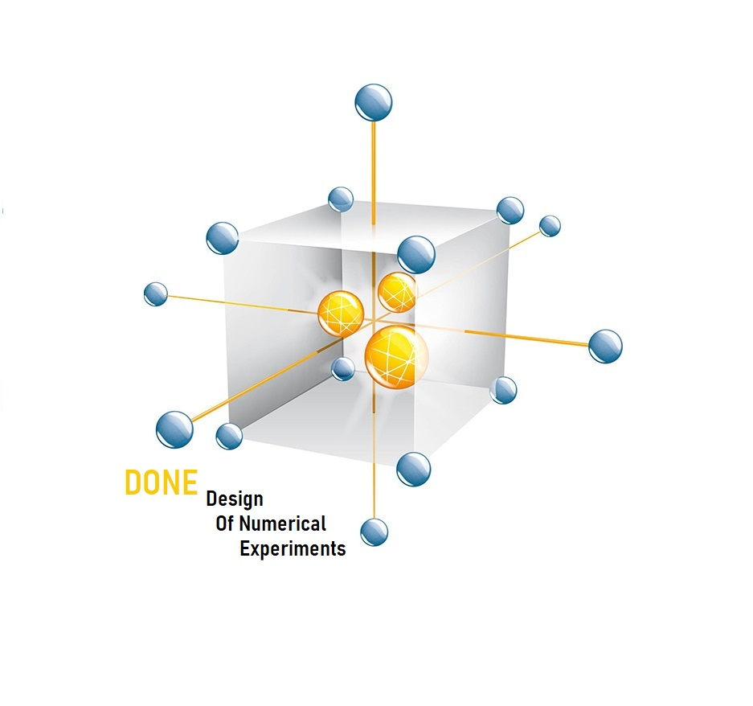

# Plan d'expériences numériques pour la calibration de codes de calcul coûteux (à sortie scalaire)

Ce dépôt contient des stratégies de planification sequentielle d'experiences numériques pour la calibration d'un code de calculs coûteux à sortie scalaire. Le cadre statistique utilisé est celui de [Kennedy et O'Hagan (2001)](https://www.asc.ohio-state.edu/statistics/comp_exp/jour.club/kennedy01.pdf). 

Les stratégies de planification séquentielle d'expériences numériques reposent sur les trois étapes suivantes :

1. **Construction de l’émulateur initial** : construire un modèle de processus gaussien (GP) à partir d’un plan d’expériences numériques initial et des évaluations correspondantes du code de calcul.
2. **Sélection séquentielle des expériences numériques** : sélectionner séquentiellement de nouveaux points d’évaluation à l’aide d’une fonction d’acquisition et mettre à jour l’émulateur GP.
3. **Estimation des paramètres de calibration** : estimer les paramètres de calibration par échantillonnage MCMC de la densité a posteriori approchée.

## Description

### Stratégies implémentées
### Entrées des fonctions

- `M` : taille du plan séquentiel
- `code` : code de calcul coûteux
- `model` : émulateur GP initial
- `Xobs`, `Yobs` : plan d’expériences physiques et observations physiques
- `Dx`, `Dtheta` : domaine des variables de contrôle et domaine des paramètres
- `sigeps` : écart-type des erreurs de mesure
- `rprior`, `dprior` : densité a priori et fonction d’échantillonnage selon cette densité
- `Lmc`, `Lopt`, `Lmcmc` : tailles d’échantillonnage pour :
  - Monte Carlo (`Lmc`)
  - Optimisation gloutonne (`Lopt`)
  - Chaîne MCMC (`Lmcmc`)
- `ctype` : type de critère d’échantillonnage ; valeurs possibles : `"VAR"` ou `"VARprior"`
- `SURtype` : type de stratégie SUR ; valeurs possibles : `"SUR1"`, `"SUR2"` ou `"SUR3"`

### Sorties

- `D` : plan d’expériences numériques
- `fD` : évaluations numériques associées
- `model` : modèle de processus gaussien mis à jour
- `chain` : chaîne MCMC d’échantillons de la densité a posteriori
- `thetamap` : moyenne a posteriori des paramètres

## Fonctions d'acquisition 
### Divergence de Kullback-Leibler

```{r}
KLdone(M, code, model, Xobs, Yobs, Dx, Dtheta, sigeps, ctype, rprior, dprior, Lmc, Lopt, Lmcmc)
```

### Réduction Séquentielle d'Incertitudes (SUR)

```{r}
SUR(M, code, model, Xobs, Yobs, Dx, Dtheta, sigeps, SURtype, rprior, dprior, Lmc, Lopt, Lmcmc)
```

### Entropie de Classification

```{r}
ENTdone(M, code, model, Xobs, Yobs, Dx, Dtheta, sigeps, ctype, rprior, dprior, Lopt, Lmc, Lmcmc)
```


### Somme des Écarts Carrés Pondérés (SSW)

```{r}
SSWdone(M, code, model, Xobs, Yobs, Dx, Dtheta, sigeps, ctype, rprior, dprior, Lopt, Lmcmc)
```
## Installation 

Clonez ce dépôt pour télécharger les fichiers en local :

```bash
git clone https://github.com/TheseAdama/DONEcal.git
```
Vous pouvez également télécharger directement le fichier ZIP depuis GitHub.

## Package R : 
Exécutez le code suivant dans R pour installer les packages nécessaires : 

 ```r
install.packages(c("Dicekriging", "SimDesign", "lhs", "truncnorm"))
 ```

## Reference
**Adama Barry, François Bachoc, Sarah Bouquet, Miguel Munoz Zuniga, Clémentine Prieur. _Optimal Design of Physical and Numerical Experiments for Computer Code Calibration_. 2024. [hal-04615127v2](https://theses.hal.science/UNIV-UT3/hal-04615127v2)**

